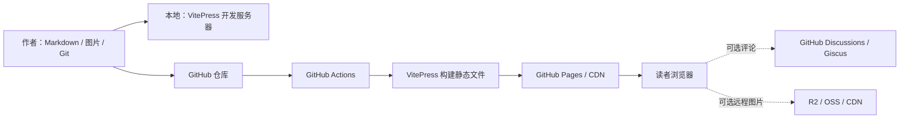

# 个人技术博客搭建全套方案

> 目标：搭建一个以 Markdown 为唯一内容源、便于长期维护的个人博客。本文是初始技术方案归档；当前项目的实际栏目为科研、投资理财、生活和就业，运行命令以根目录 `README.md` 为准。

本文以 **VitePress + pnpm + GitHub Pages** 为推荐实现，完整区分本地开发与线上部署。首页与文章模板见：

- [`templates/homepage.md`](templates/homepage.md)
- [`templates/article-template.md`](templates/article-template.md)

## 1. 目标与设计原则

### 1.1 使用场景

| 内容类型 | 主要诉求 | 推荐写法 |
| --- | --- | --- |
| 科研记录 | 可追溯实验条件、过程和结论 | 固定记录环境、数据、参数、结果和下一步 |
| 调试笔记 | 能通过错误信息快速检索 | 标题包含错误关键词，正文保留完整报错和最终修复 |
| 论文阅读 | 快速回忆论文贡献和局限 | 记录问题、方法、实验、结论、个人判断 |
| 项目复盘 | 复用工程经验 | 记录目标、决策、结果、问题和改进项 |

### 1.2 设计原则

1. **内容属于自己**：正文、元数据和图片优先保存在 Git 仓库中。
2. **本地优先**：断网也能写作和预览，线上服务故障不影响内容源。
3. **构建时完成工作**：尽量不引入数据库和常驻后端，降低维护成本。
4. **先完成最小闭环**：先上线文章、导航、搜索和暗黑模式，再添加评论、图床等外部能力。
5. **可迁移**：使用标准 Markdown 和清晰的 Frontmatter，未来可迁移到其他静态站点生成器。

## 2. 技术选型对比

### 2.1 静态博客框架

| 维度 | VitePress | Hexo | MkDocs Material |
| --- | --- | --- | --- |
| 核心生态 | Vue、Vite、TypeScript | Node.js、主题/插件生态 | Python、Material 主题 |
| 默认定位 | 技术文档、知识库 | 传统博客 | 技术文档、知识库 |
| 启动和热更新 | 快 | 中等 | 快 |
| 博客归档/标签 | 需要配置或少量开发 | 原生思路成熟 | 依赖插件 |
| 组件扩展 | 可直接在 Markdown 中使用 Vue | 依赖主题和插件约定 | 依赖主题扩展和插件 |
| 搜索 | 内置本地搜索，可接 Algolia | 通常依赖插件 | Material 内置体验较完整 |
| 代码展示 | Shiki，效果稳定 | 依主题而定 | Pygments，功能成熟 |
| 中文资料 | 较多 | 很多 | 较多 |
| 维护复杂度 | 低 | 中 | 低 |
| 更适合 | 技术博客、文档、可定制页面 | 强博客属性、主题丰富 | Python 用户、文档型站点 |

### 2.2 推荐结论

**推荐 VitePress**，理由如下：

- 内容本身以技术笔记和知识库为主，VitePress 的目录、代码块、内部链接和全文搜索更贴合核心场景。
- 默认主题已经具备响应式布局、暗黑模式、移动端导航和代码高亮，首版不需要选择复杂主题。
- 构建速度快，Markdown 中可以逐步加入 Vue 组件，后续制作论文列表、标签页或实验结果可视化时不必迁移框架。
- 静态产物可部署到 GitHub Pages、Cloudflare Pages、Vercel 或任意对象存储，平台锁定较弱。
- 配置集中在少量 TypeScript 文件中，比深度修改第三方主题更容易长期维护。

以下情况可以改选其他方案：

- 优先追求现成的归档、标签、友链、瀑布流主题和传统博客体验：选择 **Hexo**。
- 团队全部使用 Python，站点更像项目文档，并希望直接使用 Material 的丰富扩展：选择 **MkDocs Material**。

### 2.3 工具链与部署平台

| 模块 | 推荐 | 备选 | 选择理由 |
| --- | --- | --- | --- |
| 包管理 | pnpm | npm | 安装快、锁文件稳定 |
| Node.js | 22 LTS | 当前维护中的更新 LTS | 稳定且满足 VitePress 要求 |
| 内容格式 | Markdown + YAML Frontmatter | MDX | 通用、迁移成本低 |
| 代码托管 | GitHub | GitLab / Gitee | 可直接联动 Pages、Discussions |
| 首选部署 | GitHub Pages + Actions | Cloudflare Pages / Vercel | 免费、透明、可复现 |
| 评论 | Giscus | Waline | 无自建后端，评论落在 Discussions |
| 图片 | 仓库内静态资源 | Cloudflare R2 / OSS + CDN | 初期最可靠，规模增长后再拆分 |

## 3. 整体系统架构



系统不存在业务数据库和运行时服务端：

- **内容层**：Markdown、Frontmatter、图片和附件。
- **生成层**：VitePress 读取内容，Vite 打包资源，Shiki 在构建时完成代码高亮。
- **交付层**：GitHub Actions 生成 `docs/.vitepress/dist`，GitHub Pages 负责静态托管和 HTTPS。
- **外部服务层**：评论和远程图床均为可选能力，不影响正文可用性。

## 4. 页面与信息架构

### 4.1 页面规划

| 页面 | URL 示例 | 内容 | 优先级 |
| --- | --- | --- | --- |
| 首页 | `/` | 博客定位、入口、最近更新 | P0 |
| 科研记录 | `/research/` | 实验、数据、方法记录 | P0 |
| 调试笔记 | `/debugging/` | 错误现象、定位和修复 | P0 |
| 论文阅读 | `/papers/` | 论文摘要、方法和评价 | P0 |
| 项目复盘 | `/projects/` | 项目目标、决策和复盘 | P0 |
| 文章详情 | `/debugging/python-import-error` | 正文、目录、更新时间、评论 | P0 |
| 标签页 | `/tags/` | 按技术主题聚合文章 | P1 |
| 归档页 | `/archives/` | 按年份和月份浏览 | P1 |
| 关于页 | `/about` | 作者简介、研究方向、联系方式 | P1 |
| 项目展示 | `/portfolio/` | 代表项目和可公开成果 | P2 |
| 友链/订阅 | `/links/`、`/feed.xml` | 外部资源和 RSS | P2 |

### 4.2 内容分类建议

分类只表达文章的主要用途，一篇文章只选择一个分类；标签表达技术主题，可以有多个。

```text
分类（单选）
├─ research     科研与实验
├─ debugging    代码调试
├─ papers       论文阅读
└─ projects     项目复盘

标签（多选）
├─ 语言：python / typescript / cpp
├─ 领域：machine-learning / systems / frontend
├─ 工具：pytorch / docker / git
└─ 方法：profiling / testing / reproducibility
```

不要为每个细粒度主题创建目录。目录长期稳定，标签可以随内容增长而调整。

## 5. 核心功能清单

### 5.1 首次上线必须完成

- [ ] 首页、四个分类入口、关于页和 404 页面
- [ ] 响应式导航与侧边栏
- [ ] 文章内目录导航
- [ ] 代码语法高亮和行号
- [ ] 本地全文搜索
- [ ] 亮色/暗黑/跟随系统三种外观状态
- [ ] 更新时间和上一篇/下一篇导航
- [ ] GitHub Actions 自动构建部署
- [ ] 基础 SEO：标题、描述、站点地图、语义化标题层级
- [ ] 移动端检查、死链检查和构建验证

### 5.2 第二阶段扩展

- [ ] 标签聚合与时间归档
- [ ] Giscus 评论
- [ ] RSS 订阅
- [ ] 自定义域名和访问统计
- [ ] 图片压缩、远程对象存储和 CDN
- [ ] Algolia DocSearch（文章规模较大时）

## 6. 推荐目录结构

```text
tech-blog/
├─ .github/
│  └─ workflows/
│     └─ deploy.yml
├─ docs/
│  ├─ .vitepress/
│  │  ├─ config.mts
│  │  ├─ cache/                 # 构建缓存，不提交
│  │  ├─ dist/                  # 构建产物，不提交
│  │  └─ theme/
│  │     ├─ index.ts
│  │     ├─ custom.css
│  │     └─ components/
│  │        └─ GiscusComment.vue
│  ├─ public/
│  │  ├─ favicon.svg
│  │  ├─ CNAME                 # 使用自定义域名时创建
│  │  └─ images/
│  │     ├─ common/
│  │     └─ 2026/
│  ├─ research/
│  │  ├─ index.md
│  │  └─ reproducible-experiment.md
│  ├─ debugging/
│  │  ├─ index.md
│  │  └─ python-import-error.md
│  ├─ papers/
│  │  ├─ index.md
│  │  └─ attention-is-all-you-need.md
│  ├─ projects/
│  │  ├─ index.md
│  │  └─ project-a-retrospective.md
│  ├─ tags/
│  │  └─ index.md
│  ├─ archives/
│  │  └─ index.md
│  ├─ index.md
│  ├─ about.md
│  └─ 404.md
├─ templates/
│  ├─ homepage.md
│  └─ article-template.md
├─ .gitignore
├─ package.json
├─ pnpm-lock.yaml
└─ README.md
```

约定：`docs/` 是 VitePress 源目录，`docs/public/` 下的文件会原样复制到站点根目录，文章图片统一放在 `docs/public/images/`。

## 7. 从零初始化项目

### 7.1 环境准备

安装以下工具：

- Git
- Node.js 22 LTS
- VS Code（推荐扩展：Vue - Official、Markdown All in One）

检查版本：

```powershell
git --version
node --version
corepack --version
```

启用 pnpm：

```powershell
corepack enable
corepack prepare pnpm@10 --activate
pnpm --version
```

如果 Windows 因权限问题无法执行 `corepack enable`，可改用：

```powershell
npm install --global pnpm@10
pnpm --version
```

### 7.2 创建项目

```powershell
mkdir tech-blog
cd tech-blog
git init
pnpm init
pnpm add --save-dev vitepress
pnpm exec vitepress init
```

初始化向导建议选择：

```text
Where should VitePress initialize the config?  ./docs
Site title:                                  你的名字的技术博客
Site description:                            科研、工程与持续学习记录
Theme:                                       Default Theme
Use TypeScript for config and theme files?    Yes
Add VitePress npm scripts to package.json?    Yes
Add a prefix for VitePress npm scripts?       Yes（使用 docs）
```

确认 `package.json` 至少包含以下内容；版本号由安装命令和锁文件管理，不必手写固定版本：

```json
{
  "name": "tech-blog",
  "private": true,
  "type": "module",
  "scripts": {
    "docs:dev": "vitepress docs --host 0.0.0.0",
    "docs:build": "vitepress build docs",
    "docs:preview": "vitepress preview docs --host 0.0.0.0"
  },
  "devDependencies": {
    "vitepress": "^1.6.0"
  }
}
```

`.gitignore`：

```gitignore
node_modules/
docs/.vitepress/cache/
docs/.vitepress/dist/
.DS_Store
Thumbs.db
*.log
.env
.env.*
!.env.example
```

## 8. VitePress 核心配置

将 `docs/.vitepress/config.mts` 调整为下面的基础配置，再替换域名、仓库地址和作者信息。

```ts
import { defineConfig } from 'vitepress'

const base = process.env.VITEPRESS_BASE || '/'
const siteUrl = process.env.SITE_URL || 'https://yourname.github.io'

export default defineConfig({
  lang: 'zh-CN',
  title: '你的名字的技术博客',
  description: '科研、代码调试、论文阅读与项目复盘',
  base,
  cleanUrls: true,
  lastUpdated: true,
  sitemap: {
    hostname: siteUrl
  },
  head: [
    ['meta', { name: 'author', content: '你的名字' }],
    ['meta', { name: 'theme-color', content: '#0f766e' }],
    ['link', { rel: 'icon', href: `${base}favicon.svg` }]
  ],
  markdown: {
    lineNumbers: true,
    theme: {
      light: 'github-light',
      dark: 'github-dark'
    }
  },
  themeConfig: {
    logo: '/favicon.svg',
    nav: [
      { text: '首页', link: '/' },
      { text: '科研', link: '/research/' },
      { text: '调试', link: '/debugging/' },
      { text: '论文', link: '/papers/' },
      { text: '项目', link: '/projects/' },
      { text: '标签', link: '/tags/' },
      { text: '关于', link: '/about' }
    ],
    sidebar: {
      '/research/': [
        {
          text: '科研记录',
          items: [
            { text: '栏目说明', link: '/research/' },
            { text: '可复现实验记录', link: '/research/reproducible-experiment' }
          ]
        }
      ],
      '/debugging/': [
        {
          text: '调试笔记',
          items: [
            { text: '栏目说明', link: '/debugging/' },
            { text: 'Python 导入错误定位', link: '/debugging/python-import-error' }
          ]
        }
      ],
      '/papers/': [
        {
          text: '论文阅读',
          items: [
            { text: '栏目说明', link: '/papers/' },
            { text: 'Attention Is All You Need', link: '/papers/attention-is-all-you-need' }
          ]
        }
      ],
      '/projects/': [
        {
          text: '项目复盘',
          items: [
            { text: '栏目说明', link: '/projects/' },
            { text: '项目 A 复盘', link: '/projects/project-a-retrospective' }
          ]
        }
      ]
    },
    outline: {
      level: [2, 3],
      label: '本页目录'
    },
    search: {
      provider: 'local',
      options: {
        translations: {
          button: {
            buttonText: '搜索',
            buttonAriaLabel: '搜索文章'
          },
          modal: {
            noResultsText: '没有找到相关内容',
            resetButtonTitle: '清除查询',
            footer: {
              selectText: '选择',
              navigateText: '切换',
              closeText: '关闭'
            }
          }
        }
      }
    },
    socialLinks: [
      { icon: 'github', link: 'https://github.com/yourname' }
    ],
    editLink: {
      pattern: 'https://github.com/yourname/tech-blog/edit/main/docs/:path',
      text: '在 GitHub 上编辑此页'
    },
    lastUpdated: {
      text: '最后更新于',
      formatOptions: {
        dateStyle: 'medium',
        timeStyle: 'short'
      }
    },
    docFooter: {
      prev: '上一篇',
      next: '下一篇'
    },
    darkModeSwitchLabel: '外观',
    sidebarMenuLabel: '目录',
    returnToTopLabel: '返回顶部',
    footer: {
      message: '内容采用 CC BY 4.0 许可；代码示例另有说明时除外。',
      copyright: 'Copyright © 2026-present 你的名字'
    }
  }
})
```

注意：`logo`、Markdown 图片和内部链接优先使用站点绝对路径。部署在 GitHub 项目子路径时，VitePress 会处理主题配置中的路径；自定义组件中的链接应使用 `withBase()`。

## 9. 主题与样式配置

`docs/.vitepress/theme/index.ts`：

```ts
import DefaultTheme from 'vitepress/theme'
import './custom.css'

export default {
  extends: DefaultTheme
}
```

`docs/.vitepress/theme/custom.css`：

```css
:root {
  --vp-c-brand-1: #0f766e;
  --vp-c-brand-2: #0d9488;
  --vp-c-brand-3: #14b8a6;
  --vp-c-brand-soft: rgba(15, 118, 110, 0.14);
  --vp-layout-max-width: 1440px;
}

.dark {
  --vp-c-brand-1: #5eead4;
  --vp-c-brand-2: #2dd4bf;
  --vp-c-brand-3: #14b8a6;
  --vp-c-brand-soft: rgba(45, 212, 191, 0.16);
}

body {
  font-family:
    Inter, ui-sans-serif, system-ui, -apple-system, BlinkMacSystemFont,
    "Segoe UI", "Microsoft YaHei", "PingFang SC", sans-serif;
  letter-spacing: 0;
}

.VPDoc .content-container {
  max-width: 860px !important;
}

.vp-doc img {
  border: 1px solid var(--vp-c-divider);
  border-radius: 6px;
}

.vp-doc table {
  display: table;
  width: 100%;
}

@media (max-width: 640px) {
  .vp-doc table {
    display: block;
    overflow-x: auto;
  }
}
```

主题建议：

- 保留默认主题的信息密度和交互，避免首版重写布局。
- 正文字宽控制在约 `760px` 到 `860px`，长文阅读更稳定。
- 中文正文不使用过小字号；代码、表格和长 URL 必须在移动端验证。
- 品牌色只用于链接和交互状态，正文保持中性色，暗黑模式避免纯黑背景。

## 10. 写作规范

### 10.1 文件和 URL 命名

- 文件名使用小写英文和连字符：`python-import-error.md`。
- URL 一经公开尽量不更改；标题可以修改，文件名保持稳定。
- 图片名表达内容：`training-loss-curve.webp`，不要使用 `image-1.png`。
- 一个 Markdown 文件只包含一篇文章；超长系列文章使用目录拆分。

### 10.2 Frontmatter 规范

```yaml
---
title: Python ModuleNotFoundError 排查记录
description: 从解释器、工作目录和包路径三个层面定位 Python 导入失败
date: '2026-08-12'
updated: '2026-08-12'
category: debugging
tags:
  - python
  - environment
  - debugging
draft: false
comments: true
outline: [2, 3]
---
```

字段约定：

| 字段 | 必填 | 说明 |
| --- | --- | --- |
| `title` | 是 | 清晰描述问题或主题，避免“随笔 1” |
| `description` | 是 | 80 到 160 字的独立摘要，可用于搜索和 SEO |
| `date` | 是 | 首次发布日，格式固定为 `YYYY-MM-DD` |
| `updated` | 是 | 内容发生实质变化时更新 |
| `category` | 是 | `research/debugging/papers/projects` 四选一 |
| `tags` | 是 | 建议 2 到 5 个，统一小写英文标签 |
| `draft` | 是 | 草稿为 `true`，发布前改为 `false` |
| `comments` | 否 | 默认开启；敏感或纯索引页面关闭 |
| `outline` | 否 | 默认展示二、三级标题 |

VitePress 不会自动排除 `draft: true` 的页面。草稿如果不能公开，最可靠的方法是放在仓库外的私人笔记区，或在构建流程中明确添加草稿过滤插件；不要仅依赖首页不展示。

### 10.3 正文结构

通用技术文章建议使用：

1. 一句话摘要或 TL;DR。
2. 背景与目标。
3. 环境、版本和前置条件。
4. 现象、数据或原始报错。
5. 分析过程与关键证据。
6. 最终方案和可复制代码。
7. 验证结果。
8. 局限、后续工作和参考资料。

代码块必须标注语言，并尽量提供能独立运行的上下文：

````markdown
```python {3}
from pathlib import Path

project_root = Path(__file__).resolve().parents[1]
print(project_root)
```
````

其他约定：

- 标题只逐级下降，不从 `##` 跳到 `####`。
- 命令说明运行目录和系统，提示符不要放进代码块，便于直接复制。
- 报错信息保留关键原文，删除令牌、邮箱、内网地址和真实数据路径。
- 结论与事实区分；无法确定的判断明确写出验证条件。
- 引用论文、文档或代码时保留原始链接、版本和访问日期。
- 图片必须有替代文本，图表正文中说明结论，不让颜色成为唯一信息载体。

### 10.4 四类文章的补充字段

| 类型 | 建议额外记录 |
| --- | --- |
| 科研记录 | 假设、数据集版本、随机种子、硬件、依赖锁文件、实验编号、指标 |
| 调试笔记 | 完整错误、最小复现、排除过程、根因、修复、回归验证 |
| 论文阅读 | 论文信息、研究问题、贡献、方法、实验、局限、与已有工作的关系 |
| 项目复盘 | 目标、范围、架构决策、时间线、结果、事故、经验、行动项 |

## 11. 本地开发与调试流程

### 11.1 日常开发

首次克隆：

```powershell
git clone https://github.com/yourname/tech-blog.git
cd tech-blog
corepack enable
pnpm install --frozen-lockfile
pnpm docs:dev
```

浏览器访问：

```text
http://localhost:5173
```

新建文章后的推荐流程：

```powershell
Copy-Item templates/article-template.md docs/debugging/new-article.md
pnpm docs:dev
```

编辑完成后执行生产构建和预览：

```powershell
pnpm docs:build
pnpm docs:preview
```

`docs:dev` 只证明开发模式可运行；发布前必须通过 `docs:build`，因为死链、SSR 不兼容组件和部分配置错误只会在生产构建中暴露。

### 11.2 发布前检查

```powershell
git status --short
pnpm docs:build
pnpm docs:preview
```

人工检查：

- 首页、分类页和新文章均可打开。
- 站内链接、标题锚点、图片和代码块正常。
- 桌面端与窄屏均无横向溢出。
- 亮色、暗黑和跟随系统三种状态可读。
- 搜索能命中文章标题、正文关键词和中文内容。
- 正文没有令牌、个人隐私、未脱敏日志和受限制的数据。
- GitHub Pages 子路径部署时刷新文章页不会丢失样式。

提交并推送：

```powershell
git add .
git commit -m "docs: publish article about python imports"
git push origin main
```

推荐提交前缀：`docs:` 发布内容，`feat:` 增加站点能力，`fix:` 修复页面或构建问题，`chore:` 升级依赖和维护配置。

## 12. GitHub Pages 部署完整步骤

### 12.1 创建远程仓库

在 GitHub 创建公开仓库：

- 用户站点：仓库名必须是 `yourname.github.io`，默认访问路径为 `/`。
- 项目站点：仓库名可为 `tech-blog`，默认访问路径为 `/tech-blog/`。

关联并推送：

```powershell
git branch -M main
git remote add origin https://github.com/yourname/tech-blog.git
git add .
git commit -m "chore: initialize VitePress blog"
git push -u origin main
```

### 12.2 配置部署路径

在 GitHub 仓库进入 **Settings → Secrets and variables → Actions → Variables**，创建：

| 变量 | 用户站点或自定义域名 | 项目站点示例 |
| --- | --- | --- |
| `VITEPRESS_BASE` | `/` | `/tech-blog/` |
| `SITE_URL` | `https://yourname.github.io` | `https://yourname.github.io/tech-blog/` |

`VITEPRESS_BASE` 必须以 `/` 开头和结尾，并与 `config.mts` 中读取的环境变量保持一致。

### 12.3 添加 GitHub Actions 工作流

创建 `.github/workflows/deploy.yml`：

```yaml
name: Deploy VitePress site to Pages

on:
  push:
    branches: [main]
  workflow_dispatch:

permissions:
  contents: read
  pages: write
  id-token: write

concurrency:
  group: pages
  cancel-in-progress: false

jobs:
  build:
    runs-on: ubuntu-latest
    env:
      VITEPRESS_BASE: ${{ vars.VITEPRESS_BASE || '/' }}
      SITE_URL: ${{ vars.SITE_URL || 'https://yourname.github.io' }}
    steps:
      - name: Checkout
        uses: actions/checkout@v4
        with:
          fetch-depth: 0

      - name: Install pnpm
        uses: pnpm/action-setup@v4
        with:
          version: 10

      - name: Setup Node
        uses: actions/setup-node@v4
        with:
          node-version: 22
          cache: pnpm

      - name: Install dependencies
        run: pnpm install --frozen-lockfile

      - name: Build
        run: pnpm docs:build

      - name: Configure Pages
        uses: actions/configure-pages@v5

      - name: Upload artifact
        uses: actions/upload-pages-artifact@v3
        with:
          path: docs/.vitepress/dist

  deploy:
    environment:
      name: github-pages
      url: ${{ steps.deployment.outputs.page_url }}
    runs-on: ubuntu-latest
    needs: build
    steps:
      - name: Deploy to GitHub Pages
        id: deployment
        uses: actions/deploy-pages@v4
```

### 12.4 启用 Pages

1. 打开仓库 **Settings → Pages**。
2. 在 **Build and deployment** 中将 Source 选择为 **GitHub Actions**。
3. 推送一次 `main`，在 **Actions** 页面观察构建和部署两个任务。
4. 部署成功后访问 Pages 给出的地址。
5. 修改一篇文章再次推送，确认自动更新正常。

### 12.5 自定义域名与 HTTPS

以 `blog.example.com` 为例：

1. 创建 `docs/public/CNAME`，内容只有一行：

   ```text
   blog.example.com
   ```

2. 在 DNS 服务商添加 CNAME：

   ```text
   类型: CNAME
   主机记录: blog
   目标: yourname.github.io
   ```

3. 将 `VITEPRESS_BASE` 设置为 `/`，`SITE_URL` 设置为 `https://blog.example.com`。
4. 在 GitHub **Settings → Pages → Custom domain** 填入域名并等待 DNS 检查通过。
5. DNS 生效并签发证书后开启 **Enforce HTTPS**。

如果使用根域名 `example.com`，应按 GitHub Pages 当前文档配置 A/AAAA 或 ALIAS/ANAME 记录；不要照搬过期 IP。切换域名后重点检查 canonical URL、站点地图、图片和评论映射。

### 12.6 部署成功验收

- Actions 最近一次运行全部为绿色。
- 首页和深层文章地址都返回 `200`。
- 浏览器地址栏为 HTTPS，证书域名正确。
- CSS、字体、图片没有 `404`。
- `sitemap.xml` 可访问且 URL 前缀正确。
- GitHub 项目站点的资源路径都包含正确的 `base`。
- 从无痕窗口测试搜索和 Giscus，避免被自己的登录状态掩盖问题。

## 13. 其他部署方式

### 13.1 Cloudflare Pages

适合希望获得全球 CDN、预览环境或后续使用 R2 的情况：

1. 在 Cloudflare Pages 连接 GitHub 仓库。
2. Production branch 填 `main`。
3. Build command 填 `pnpm docs:build`。
4. Build output directory 填 `docs/.vitepress/dist`。
5. 环境变量设置 `NODE_VERSION=22`、`VITEPRESS_BASE=/`、`SITE_URL=https://你的域名`。
6. 部署后绑定自定义域名，并重新检查 `sitemap.xml`。

Cloudflare Pages 根路径部署时 `base` 通常为 `/`。不要同时启用 GitHub Pages 与 Cloudflare 的生产域名，否则容易出现搜索引擎重复收录。

### 13.2 Vercel

1. 导入 GitHub 仓库。
2. Framework Preset 选择 `VitePress`，无法识别时选 `Other`。
3. Install Command 填 `pnpm install --frozen-lockfile`。
4. Build Command 填 `pnpm docs:build`。
5. Output Directory 填 `docs/.vitepress/dist`。
6. 设置 `VITEPRESS_BASE=/` 和正确的 `SITE_URL`。

## 14. 可选扩展功能

### 14.1 标签分类与归档

VitePress 没有内置博客数据库。推荐把 Frontmatter 作为唯一数据源，在构建时通过 `createContentLoader` 收集文章，避免手工维护多份列表。

创建 `docs/content.data.ts`：

```ts
import { createContentLoader } from 'vitepress'

export interface Post {
  title: string
  description: string
  url: string
  date: string
  category: string
  tags: string[]
}

declare const data: Post[]
export { data }

export default createContentLoader('**/*.md', {
  transform(source): Post[] {
    return source
      .filter(({ frontmatter }) => frontmatter.date && !frontmatter.draft)
      .map(({ url, frontmatter }) => ({
        title: frontmatter.title,
        description: frontmatter.description || '',
        url,
        date: String(frontmatter.date),
        category: frontmatter.category || 'uncategorized',
        tags: frontmatter.tags || []
      }))
      .sort((a, b) => Date.parse(b.date) - Date.parse(a.date))
  }
})
```

标签页可以在 `<script setup>` 中导入 `data`，按 `tags` 分组；归档页按 `date.slice(0, 7)` 分组。自定义链接使用 `withBase(post.url)`，确保 GitHub 项目子路径部署正常。

当文章超过约 100 篇时，再考虑自动生成侧边栏、分页和单独标签路由。首版用一个标签聚合页足够，过早引入博客主题插件会增加升级风险。

### 14.2 文章搜索

首选前面 `themeConfig.search.provider = 'local'` 的本地搜索：

- 无第三方账号和网络请求。
- 中文内容可以搜索。
- 构建产物随文章数量增长，个人博客通常可以接受。

文章达到数百篇、需要更强的分词和跨站检索时再接入 Algolia DocSearch。切换后要配置公开的 App ID、Index Name 和 Search API Key；管理密钥绝不能写入前端仓库。

### 14.3 目录导航

全局配置：

```ts
outline: {
  level: [2, 3],
  label: '本页目录'
}
```

单篇文章覆盖：

```yaml
---
outline: [2, 4]
---
```

建议正文只展示二、三级标题。四级标题过多通常意味着文章结构应该拆分。

### 14.4 暗黑模式

VitePress 默认支持亮色、暗黑和跟随系统，无需额外插件。自定义组件和图片需要额外验证：

- CSS 颜色使用 VitePress 变量，不写死白底黑字。
- 架构图优先使用 Mermaid，或分别提供浅色/深色图片。
- 截图如果只有浅色版本，为图片添加边框，避免与背景混在一起。

如需禁用外观切换，可配置 `appearance: false`，但技术博客通常建议保留默认行为。

### 14.5 评论系统 Giscus

适用条件：仓库公开、已开启 GitHub Discussions、读者接受使用 GitHub 登录。

安装：

```powershell
pnpm add @giscus/vue
```

先访问 Giscus 官网完成仓库授权并取得 `repo-id`、`category-id`，然后创建 `docs/.vitepress/theme/components/GiscusComment.vue`：

```vue
<script setup lang="ts">
import { computed } from 'vue'
import Giscus from '@giscus/vue'
import { useData } from 'vitepress'

const { frontmatter, isDark, page } = useData()
const enabled = computed(
  () => frontmatter.value.comments !== false && page.value.relativePath.includes('/')
)
</script>

<template>
  <Giscus
    v-if="enabled"
    repo="yourname/tech-blog"
    repo-id="替换为你的 repo-id"
    category="Announcements"
    category-id="替换为你的 category-id"
    mapping="pathname"
    strict="1"
    reactions-enabled="1"
    emit-metadata="0"
    input-position="bottom"
    :theme="isDark ? 'dark' : 'light'"
    lang="zh-CN"
    loading="lazy"
  />
</template>
```

再更新 `docs/.vitepress/theme/index.ts`：

```ts
import { h } from 'vue'
import DefaultTheme from 'vitepress/theme'
import GiscusComment from './components/GiscusComment.vue'
import './custom.css'

export default {
  extends: DefaultTheme,
  Layout() {
    return h(DefaultTheme.Layout, null, {
      'doc-after': () => h(GiscusComment)
    })
  }
}
```

建议使用 `mapping="pathname"` 并保持文章 URL 稳定。移动文章后，旧 Discussion 不会自动迁移到新路径。

如果希望匿名评论、邮件通知或完整管理后台，可选 Waline，但需要额外部署服务端和数据库，维护成本明显更高。

### 14.6 代码高亮

VitePress 默认使用 Shiki，无需额外高亮插件。常用写法：

````markdown
```ts {2,5-7}
const port = 5173
const host = '127.0.0.1'

export const server = {
  host,
  port,
  strictPort: true
}
```
````

- `{2,5-7}` 高亮指定行。
- 代码块第一行使用合法语言标识，如 `python`、`ts`、`bash`、`json`。
- 超长日志只保留定位所需部分，完整日志可折叠或作为附件。
- 复制后可执行的代码不要包含 shell 提示符 `$` 或 `>`。

### 14.7 图片托管

**初期推荐仓库内托管**：

```text
docs/public/images/2026/python-import/module-search-path.webp
```

Markdown 引用：

```markdown

```

实践规则：

- 普通截图优先转为 WebP，图表可使用 SVG 或 WebP；保留文字清晰度。
- 单图尽量小于 500 KB，提交前移除 EXIF、GPS 等隐私元数据。
- 不要直接引用临时聊天、笔记软件或他人站点的图片地址。
- 图片多于数 GB 或流量明显增长后，再迁移到 Cloudflare R2、阿里云 OSS 或腾讯云 COS，并绑定 CDN 域名。
- 使用对象存储时开启 HTTPS、长缓存和版本化文件名；保留原图备份和批量迁移映射。
- PicGo 只负责上传体验，真正需要设计的是对象命名、备份、权限和迁移策略。

### 14.8 访问统计与隐私

轻量选择可使用 Cloudflare Web Analytics 或 Plausible。不要为了访问量默认接入侵入式追踪；至少在关于页说明收集的数据、Cookie 使用情况和退出方式。任何统计脚本加入后都要检查其对首屏速度和隐私的影响。

## 15. 首页与文章模板

### 15.1 首页模板

可直接将 [`templates/homepage.md`](templates/homepage.md) 复制为 `docs/index.md`。模板采用 VitePress 默认首页布局，包含四类内容入口和最近更新区域。

### 15.2 文章模板

可将 [`templates/article-template.md`](templates/article-template.md) 复制到对应分类目录后修改。模板覆盖摘要、环境、过程、解决方案、验证、复盘和参考资料，使用时删除不适用章节。

## 16. 常见踩坑与处理办法

| 问题 | 典型现象 | 原因与处理 |
| --- | --- | --- |
| GitHub Pages 白屏或样式 404 | 首页只有文字或控制台资源 404 | 项目站点 `base` 未设置为 `/仓库名/`；检查仓库变量和构建日志 |
| 自定义域名资源路径错误 | 换域名后图片或 CSS 404 | 自定义域名应使用 `base: '/'`，重新构建部署 |
| 本地正常、生产构建失败 | `document is not defined` | 组件在 SSR 阶段访问浏览器 API；放到 `onMounted` 或使用客户端组件策略 |
| 深层链接刷新 404 | 点击可开，刷新失败 | 托管平台路由/产物路径配置错误；GitHub Pages 使用 VitePress 静态生成页面，不要改成 SPA fallback |
| 图片本地可见、线上丢失 | Linux 构建时报 404 | Windows 不区分大小写，Linux 区分；统一文件名大小写并检查 Git 记录 |
| 中文路径兼容问题 | URL 编码混乱、外链难分享 | 页面文件名使用英文连字符，中文只放标题 |
| `pnpm install --frozen-lockfile` 失败 | Actions 提示锁文件过期 | 修改依赖后运行 `pnpm install` 并提交 `pnpm-lock.yaml` |
| 搜索不到新文章 | 本地搜索结果旧 | 清理 `docs/.vitepress/cache` 后重新构建，确认文章未被构建过滤 |
| 草稿意外公开 | 知道 URL 就能访问 | `draft` 不会自动阻止 VitePress 输出页面；使用构建过滤或不要把私密草稿放入公开仓库 |
| Giscus 不显示 | 页面底部空白 | 检查仓库公开性、Discussions、Giscus App 授权、`repo-id` 和 `category-id` |
| 评论与文章错位 | 改 URL 后出现新讨论 | `pathname` 映射依赖稳定 URL；迁移时同步处理 Discussion |
| 更新时间全部变成部署时间 | 每次发布所有文章都更新 | 使用完整 Git 历史，`actions/checkout` 必要时配置 `fetch-depth: 0` |
| 站点地图 URL 错误 | 带重复子路径或 localhost | `SITE_URL` 应是最终公开根地址，并与 `base` 的部署方式匹配 |
| 大图片导致加载慢 | 移动网络首屏很慢 | 压缩、调整尺寸、使用 WebP/AVIF，并为远程图片配置 CDN 缓存 |
| Node 或 pnpm 版本漂移 | 本地可用、CI 失败 | 本地和 Actions 使用同一 Node LTS 与 pnpm 主版本，提交锁文件 |
| Corepack 权限错误 | Windows 无法创建链接 | 使用管理员终端，或改用 `npm install --global pnpm@10` |
| Markdown 中泄露敏感信息 | 公开仓库出现密钥或路径 | 发布前人工脱敏；密钥一旦提交应立即吊销，仅删除当前文件不够 |
| 依赖升级后主题异常 | 导航、插件或 CSS 失效 | 小步升级，先看 VitePress 变更日志，再执行完整构建和移动端检查 |

推荐工作流已经使用 `fetch-depth: 0` 拉取完整 Git 历史，因此 `lastUpdated` 能读取每篇文章的实际提交时间。仓库历史很大时可以改成浅克隆，但要接受更新时间精度下降。

## 17. 维护策略

### 17.1 推荐节奏

- 每篇文章发布前：生产构建、移动端检查、敏感信息检查。
- 每月：检查失效外链、待整理草稿、依赖安全告警。
- 每季度：小版本升级 VitePress 和插件，检查构建日志、搜索和评论。
- 每年：导出仓库和图片备份，检查域名续费、DNS、许可证和关于页。

### 17.2 备份与恢复

至少保留：

1. GitHub 远程仓库。
2. 本地完整 Git 克隆。
3. 独立的定期压缩备份，尤其是未提交草稿和远程图床原图。

静态站点恢复只需要仓库、受锁文件约束的依赖和图片源。不要把唯一副本放在构建产物 `dist` 中。

### 17.3 依赖升级

```powershell
pnpm outdated
pnpm update --interactive
pnpm docs:build
pnpm docs:preview
```

不要在发布文章的同一个提交里大规模升级依赖。内容变更和基础设施变更分开，出问题时更容易回滚和定位。

## 18. 推荐实施顺序

### 第 1 天：完成最小可用站点

1. 初始化 VitePress、配置导航、侧边栏和主题色。
2. 建立四类目录、首页、关于页和第一篇真实文章。
3. 启用本地搜索、目录、暗黑模式和代码高亮。
4. 本地执行 `docs:build` 和 `docs:preview`。

### 第 2 天：完成上线闭环

1. 创建 GitHub 仓库和 Actions 工作流。
2. 配置 `base`、部署并完成验收。
3. 绑定自定义域名（如需要）。
4. 建立文章模板和发布检查清单。

### 内容稳定后再做

1. 通过 Content Loader 生成标签和归档。
2. 启用 Giscus。
3. 增加 RSS、统计与远程图床。
4. 根据真实使用问题开发自定义 Vue 组件，避免为“可能需要”提前增加复杂度。

## 19. 最终验收清单

- [ ] `pnpm install --frozen-lockfile` 在干净环境成功。
- [ ] `pnpm docs:build` 无错误、死链和敏感信息警告。
- [ ] 首页明确展示博客主题和四类内容入口。
- [ ] 至少一篇真实文章使用统一 Frontmatter 和正文结构。
- [ ] 导航、搜索、目录、暗黑模式、代码高亮可用。
- [ ] 桌面端和手机端不存在遮挡、溢出和不可读内容。
- [ ] Pages 自动部署成功，公开地址和站点地图正确。
- [ ] 仓库内没有 `.env`、令牌、真实隐私数据和不应公开的草稿。
- [ ] README 写明本地启动、构建和发布命令。
- [ ] 内容和图片至少有两份独立备份。

## 20. 官方参考资料

- [VitePress 官方文档](https://vitepress.dev/)
- [VitePress 部署指南](https://vitepress.dev/guide/deploy)
- [GitHub Pages 官方文档](https://docs.github.com/pages)
- [Giscus](https://giscus.app/zh-CN)
- [Cloudflare Pages](https://developers.cloudflare.com/pages/)

涉及 Node.js、GitHub Actions 和第三方插件版本时，以实施当天的官方兼容性说明为准；锁文件和 CI 中的运行时版本应保持明确，避免自动漂移。
